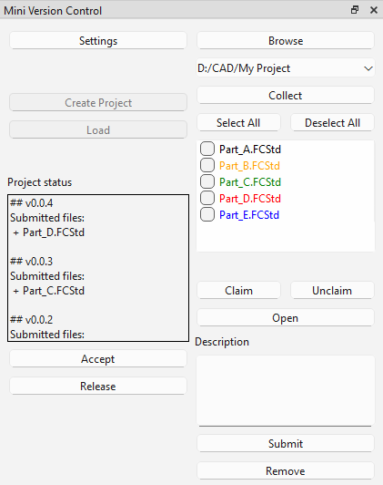

## MVC Workspace
Workspace manager and GUI for interacting with "Mini Version Control".

### Use
- When using the first time, open the settings button to configure your base path and user name.
- The open button will open an .FCStd file in FreeCAD.

For additional information about commands, see the [MVC repository](https://github.com/jelle284/mvc) 

### Workflow example
- An assembly is kept as seperate files.
- Parts in the assembly are updated and then submitted to the project.
- The submitted files are reviewed and accepted into the project.
- When the design is final, the project is released for as-built documentation.

#### About Colors
- Black means files are up-to-date.
- Orange means files have changed.
- Green means files are claimed by you.
- Red means files are claimed by other users.
- Blue means file is not in the project.